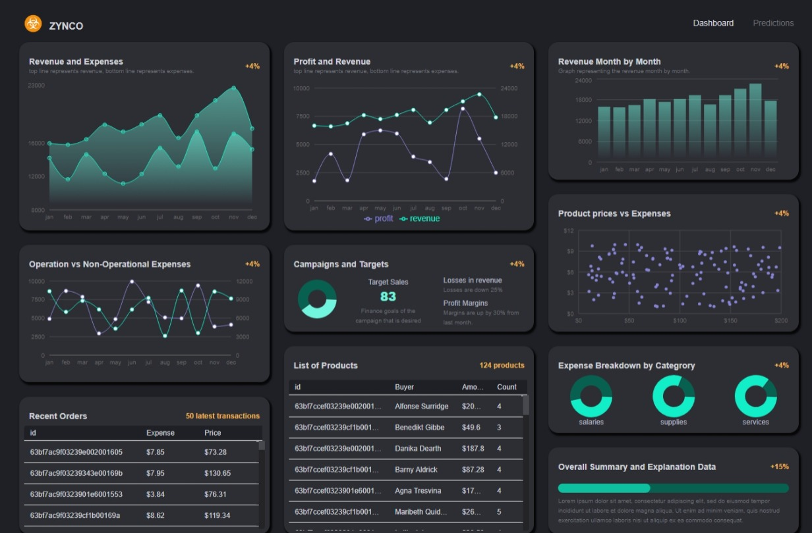

# Zynco - Finance Dashboard with ML Predictions

**Zynco** is a comprehensive MERN-based finance dashboard that helps businesses monitor their financial data, manage product checklists, and track recent orders. The app integrates Machine Learning predictions to offer future trend analysis for better decision-making.

## Features

- **Data Visualization:** Monthly revenue and profit charts using Recharts.
- **Product Checklists:** Easily manage product availability and orders.
- **ML Predictions:** Machine Learning models predict financial trends based on historical data.
- **Backend:** Developed using Node.js, Express.js, and MongoDB to store and handle data securely.

## Tech Stack

### Frontend:
- **Vite**: Lightning-fast development environment.
- **Redux Toolkit**: State management.
- **Material UI**: Pre-built UI components.
- **Recharts**: Data visualization for charts.

### Backend:
- **Node.js**: Server runtime.
- **Express.js**: Backend framework.
- **MongoDB**: NoSQL database for storing financial data.
  
### Machine Learning:
- **Regression**: Used for financial predictions.

## Deployed Link

Check out the live version of Zynco here: [Deployed Link](https://zynco-rt.vercel.app/)

## Screenshots

### Dashboard Overview

### Revenue and Profit Charts

  ## Next Year 

